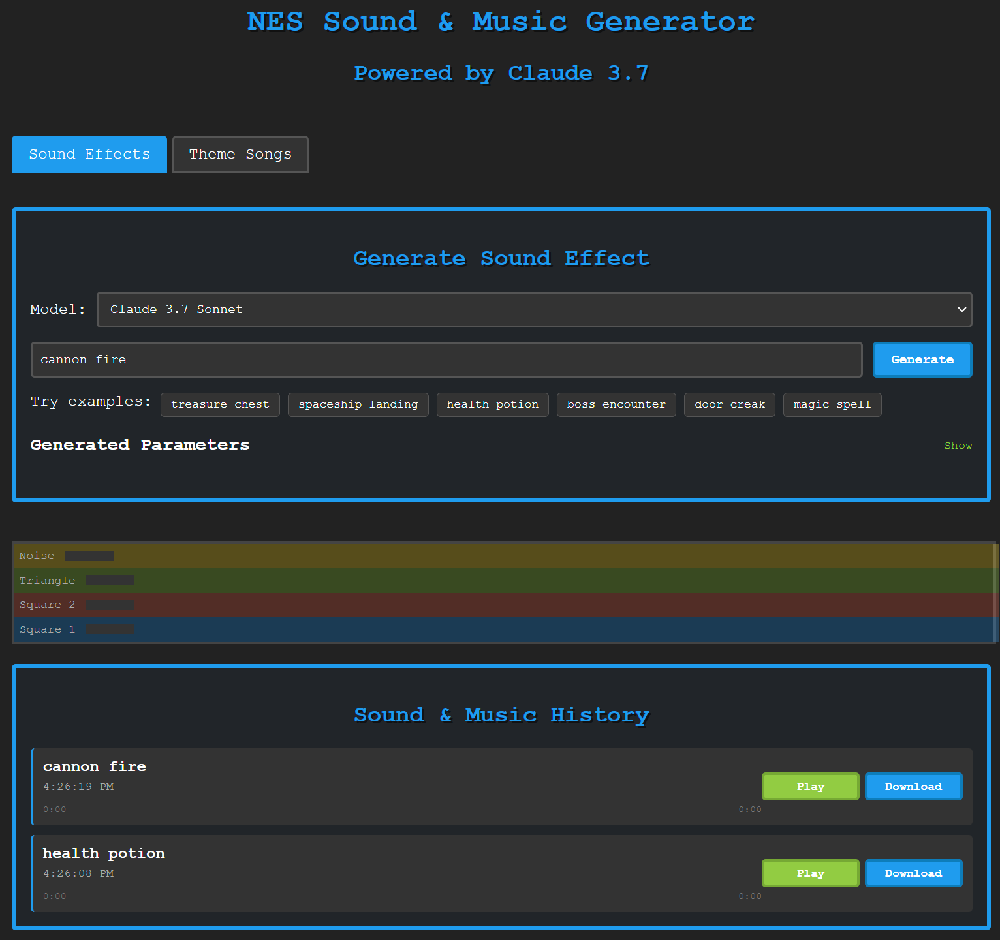

# NES Sound Generator with Claude 3.7

Since Sonnet 3.7 Extended Thinking did such a remarkable job on the initial comparison with other models, I fleshed it out into this. 

NES Sound Generator creates authentic 8-bit NES-style sound effects and music using Claude 3.7 Sonnet. This web app generates sound parameters for the Nintendo Entertainment System's audio processing unit (APU) and plays them back in your browser.

## Features

- **Sound Effects**: Generate authentic NES-style sound effects from text descriptions
- **Multi-segment Sound Effects**: Create complex sequential sounds with multiple parts that play in sequence
- **Theme Songs**: Compose short chiptune music tracks with multiple channels
- **Audio Visualization**: See real-time visualization of audio channels during playback
- **Save & Download**: Save your creations and download them as WAV files
- **AI-Powered**: Claude 3.7 Sonnet creates audio parameters that accurately mimic the NES sound capabilities

## Screenshot


## Requirements

- Node.js 18.x or later
- An Anthropic API key (Claude 3.7 access)
- Vercel account (for deployment) or can be run locally

## Setup

1. **Clone the repository**

```bash
git clone https://github.com/MatthewPDingle/nes-sound-generator.git
cd nes-sound-generator
```

2. **Install dependencies**

```bash
npm install
```

3. **Set up your API key**

Rename `.env.template` to `.env` and add your Anthropic API key:

```
ANTHROPIC_API_KEY=<paste your Anthropic API Key here>
```

You can get an API key from the [Anthropic Console](https://console.anthropic.com/).

4. **Run locally**

Using Vercel CLI:
```bash
npx vercel dev
```

The app should now be running at http://localhost:3000

## Deployment

Deploy to Vercel:

```bash
npx vercel
```

This will deploy your app to a Vercel URL and set up the necessary serverless functions.

## Demos

### Sample Sound Effects

- [Powerup Sound](https://raw.githubusercontent.com/MatthewPDingle/nes-sound-generator/main/demos/powerup.wav) - "multifaceted powerup with 3 notes: mid, low, and then high"
- [Bells Sound](https://raw.githubusercontent.com/MatthewPDingle/nes-sound-generator/main/demos/bells.wav) - "bells ringing three times"
- [Footsteps Sound](https://raw.githubusercontent.com/MatthewPDingle/nes-sound-generator/main/demos/footsteps.wav) - "three quiet fading thumping footsteps down stone stairs"

### Sample Theme Song

- [Heroic Adventure Theme](https://raw.githubusercontent.com/MatthewPDingle/nes-sound-generator/main/demos/Heroic%20adventure%20with%20opening,%20mid%20section,%20and%20outro.mp3) - "Heroic adventure with opening, mid section, and outro"


## Models

The application offers two models:
- **Claude 3.7 Sonnet**: Default model, faster and cheaper generation
- **Claude 3.7 Sonnet with Extended Thinking**: Slower and more expensive, possibly better results

## Limitations

- Sound generation is limited by the browser's Web Audio API capabilities
- Theme songs use a simplified representation of NES music capabilities
- Generation may take 5-60 seconds depending on complexity and the selected model
- The best sound effects seem to be common ones. An uncommon sound effect like "a duck quacking" often doesn't produce results that sound much like the description.
- Theme songs aren't setup to loop

## Recent Updates

### Multi-section Theme Songs (March 2025)
- Added support for complex musical compositions with distinct sections (intro, verse, chorus, etc.)
- Each section plays sequentially with proper timing and transitions
- Improved Claude prompting to create more structured and varied compositions
- Sections can have different instrumentation and musical structure
- Added compatibility with legacy theme song format

### Multi-segment Sound Effects (March 2025)
- Added support for complex sequential sound effects with multiple segments
- Each segment plays after the previous one finishes
- Improved Claude prompting to encourage multi-part sound design
- Updated playback and rendering systems to handle sequential segments
- Added compatibility layer for legacy single-segment sounds

## Methodology

Vibe coding with Claude 3.7 Sonnet Exteneded Thinking

## License

MIT

---

Have fun creating authentic NES sounds and music! Feedback and contributions welcome.